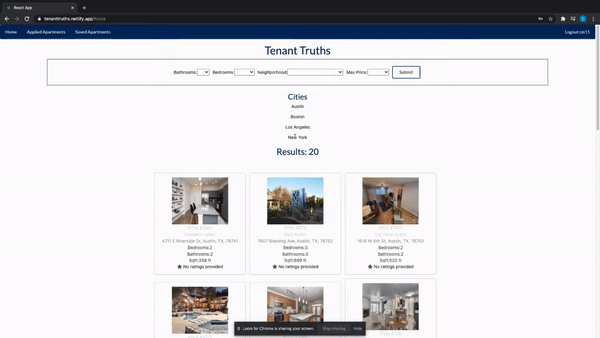
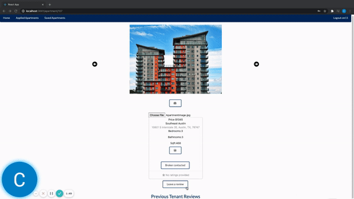

### TenantTruths - Client 

Front-end for TenantTruths, an app inspired by StreetEasy & Yelp.

## About
TenantTruths is designed to provide prospective rentors with more transparency on the apartments they are interested in. 
Built with a React front end and Ruby on Rails back end. Styling was done with Semantic UI and Custom CSS.

## Watch Video [Demo](https://www.loom.com/share/c999bfbd86124f1f8ea8418b6e252fa2)  
## Log-in Credentials for [Website](https://tenanttruths.netlify.app/)   
Username: cm11  
Password: 123  

### Features 
Browse apartment listings in various cities 

 
Leave reviews on apartments you previously leased 

Upload Photos of your previous apartment 

Save favorite listings 

Apply to listings through EmailJS integration 

To use, fork and clone this repository, & start api server and run:

-npm install && npm start

[Back End](https://github.com/cmur11/apartmentreview_backend)
