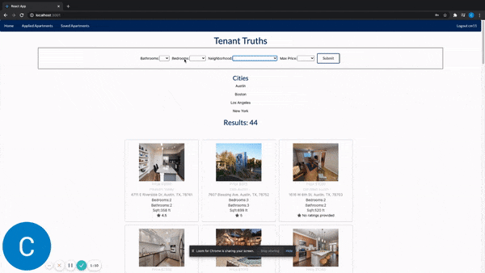

**TenantTruths - Client** 

Front-end for TenantTruths, an app inspired by StreetEasy & Yelp.
TenantTruths is designed to provide prospective rentors with more transparency on the apartments they are interested in. 
Built with a React front end and Ruby on Rails back end. Styling was done with Semantic UI and Custom CSS.

[Website](https://tenanttruths.netlify.app/) / [Demo](https://www.loom.com/share/c999bfbd86124f1f8ea8418b6e252fa2)  
Log-in Credentials for Website  
Username: cm11  
Password: 123  

[Back End](https://github.com/cmur11/apartmentreview_backend)

To use, fork and clonethis repository, & start api server and run:

-npm install && npm start

**Features** 
Browse apartment listings in various cities 
Leave reviews on apartments you previously leased 
Upload Photos of your previous apartment 
Save favorite listings 
Apply to listings through EmailJS integration 
